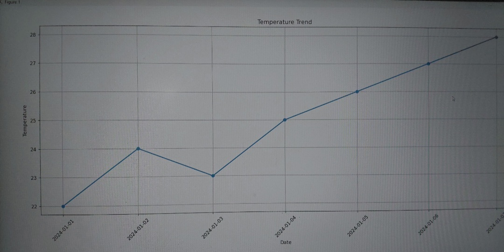
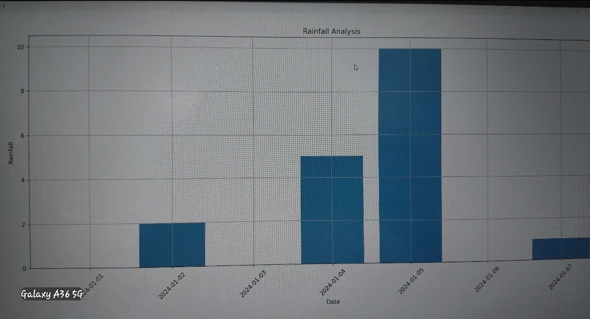

# 🌦️ Weather Data Analysis & Visualization
 
## 📌 Project Overview
This project analyzes weather data using Python to understand temperature trends, rainfall patterns, and weather distribution.
 
## 🛠️ Tools Used
- Python
- Pandas
- Matplotlib
 
## 📊 Key Insights
- Temperature shows a rising trend over time
- Rainfall patterns analyzed
- Weather distribution visualized using pie chart
 
## 📸 Output
 
### 🌡️ Temperature Trend

 
### 🌧️ Rainfall Analysis

 
### 🌤️ Weather Distribution

 
## 👩‍💻 Author
Srishti Pandey
 
